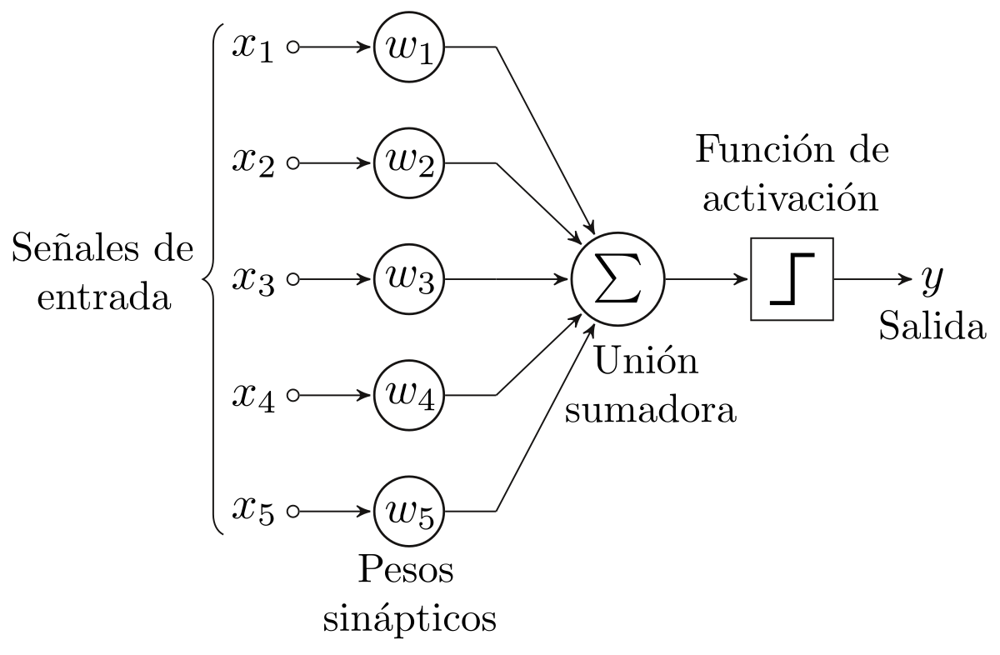

# AprendizajeAutomatico03

## Índice
1. Técnicas avanzadas de datos
    - Técnicas avanzadas de limpieza de datos
        - Eliminación de valores atípicos
        - Imputación de valores faltantes
    - Técnicas de reducción de dimensionalidad
        - Análisis de componentes principales (PCA)
        - Integración de vecinos estocásticos con distribución t (t-SNE)

2. Técnicas avanzadas de gráficos
    - Técnicas avanzadas de visualización
        - Mapas de calor y diagramas de pares
    - Análisis y visualización de series temporales
        - Plotly y Seaborn
    - Optimización de la visualización para grandes volúmenes de datos

3. Pipelines
    - Pipelines automatizados para la limpieza y el preprocesamiento de datos
    - Implementación de pipelines con scikit-learn y pandas
        - Pasos para un pipeline eficaz

4. Redes neuronales
    - Perceptrón
    - Red neuronal

## 1. Técnicas Avanzadas con Datos

### Técnicas Avanzadas de Limpieza de Datos

Repasemos uno de los primeros temas que abordamos: la Limpieza de Datos.

En la presentación inicial, limpiamos los datos mediante instrucciones de impresión e inspección manual. Este enfoque funcionó porque el conjunto de datos era pequeño. Sin embargo, con conjuntos de datos más grandes, la comprobación manual de todo se vuelve impráctica. En su lugar, necesitamos métodos más rápidos y automatizados para identificar y corregir problemas como valores atípicos y valores faltantes.

#### A) Eliminación de Valores Atípicos

Existen dos métodos estadísticos comunes y sencillos para detectar valores atípicos: **Puntuación Z** y **Rango Intercuartil (IQR)**.

- **Método de la Puntuación Z**
Mide la distancia entre un dato y la media en términos de desviaciones estándar.
    - Si la puntuación Z es \|Z\| > 3 (mayor que 3 o menor que -3), el dato generalmente se considera un valor atípico. 
    - Este método supone una distribución normal y funciona bien cuando los datos son simétricos.

<kbd></kbd>

- **Método IQR**
    El rango intercuartil se centra en el 50 % medio del conjunto de datos.
    - Define un rango "normal" y considera cualquier valor significativamente menor o mayor como un posible valor atípico.
        - El RIQ se calcula como:
        - \[ Q1 - 1,5 * RIQ, Q3 + 1,5 * RIQ \]
    - Donde **Q1** es el percentil 25 y **Q3** es el percentil 75.
    - Los valores fuera de este rango se consideran valores atípicos.

<kbd></kbd>

#### Cuándo usar cada método
- Utilice la puntuación Z si sus datos tienen una distribución normal, ya que se basa en las propiedades de la distribución normal.
- Utilice el RIQ si sus datos están asimétricos o contienen muchos valores extremos, ya que es más robusto ante distribuciones no normales y valores atípicos.

#### B) Imputación de Valores Faltantes

Existen dos métodos estadísticos comunes para completar valores faltantes: **Imputación de Media/Mediana/Moda** e **Imputación de K Vecinos Más Próximos (KNN)**.

- **Imputación de Media/Mediana/Moda**
    Cuando un conjunto de datos contiene valores faltantes (NaN), una de las técnicas más sencillas es reemplazarlos con una medida de tendencia central de la misma columna:
        - **Media**: adecuada para datos numéricos con distribución normal.
        - **Media**: más robusta ante valores atípicos y distribuciones asimétricas.
        - **Moda**: utilizada para variables categóricas o discretas.

    Este método es rápido y fácil de implementar, pero no considera las relaciones entre las características.

- **Imputador de K-Vecinos Más Cercanos (KNN)**
La imputación KNN es un enfoque más avanzado y basado en datos.

En lugar de usar un único valor estático, KNN utiliza los valores de los K vecinos (más similares) basándose en otras características.

**Cómo funciona:**

1. **Buscar filas similares:**
Para la fila con el valor faltante, KNN identifica otras filas con valores similares en las columnas restantes.
    - La similitud se mide utilizando una métrica de distancia: la distancia euclidiana.
2. **Seleccionar K vecinos:**
    - Elija las *K* filas más cercanas (vecinas).
3. **Complete el valor faltante:**
    - Si el valor faltante es **numérico**, tome el **promedio** de los valores de los vecinos.
    - Si el valor faltante es **categórico**, tome la categoría **más frecuente** entre los vecinos.

<kbd></kbd>

La imputación KNN tiene en cuenta las relaciones entre diferentes características, lo que la hace más precisa pero también más costosa computacionalmente.

### Técnicas de reducción de dimensionalidad

Cuando se trabaja con conjuntos de datos que tienen muchas características, resulta más difícil visualizar, procesar y modelar los datos.
La **reducción de dimensionalidad** ayuda a reducir el número de características, conservando al mismo tiempo la mayor cantidad de información importante posible.

Existen dos tipos principales de técnicas:
- **Lineal:** PCA
- **No lineal:** t-SNE

#### A) Análisis de Componentes Principales (ACP)

El ACP es un método de reducción de dimensionalidad **lineal** que transforma un conjunto de datos con muchas columnas en un conjunto más pequeño de nuevas columnas, llamadas **componentes principales**. Estos componentes conservan los patrones o la varianza más significativos en los datos.

- **Cómo funciona el ACP (paso a paso)**
    1. Estandarizar los datos
        - Cada característica se escala para que contribuya equitativamente al análisis.

    2. Encontrar las direcciones donde los datos varían más
        - El ACP identifica las direcciones (componentes principales) donde los datos están más dispersos.
        - A mayor dispersión (varianza), mayor interés o información.

    3. Crear nuevos ejes (componentes principales)
        - Estos nuevos ejes son **combinaciones lineales** de las características originales.
        - El **primer componente principal** captura la mayor varianza.
        - El **segundo componente principal** captura la siguiente mayor varianza y es ortogonal (independiente) al primero.

    4. Eliminar información no importante
        - Ahora puede optar por conservar solo los componentes principales (1, 2 o 3) en lugar de todas las características originales.
        - Esto reduce el tamaño de su conjunto de datos, lo que facilita su procesamiento y visualización, sin perder información importante.

  <kbd></kbd>

- **Puntos clave para recordar**
    - **Primer componente principal** = captura la mayor varianza.
    - **Segundo componente principal** = captura la siguiente mayor varianza y es **ortogonal** al primero.
    - El PCA es un método lineal, lo que significa que asume que las relaciones entre las características son rectas (no curvas).

**Ejemplo simple:**

Imagina que tienes las puntuaciones de los estudiantes en **Matemáticas** y **Ciencias**, y que ambas puntuaciones están estrechamente relacionadas.

- PCA encontraría un nuevo eje como **"Fortalecimiento Académico General"**, que es una combinación de puntajes de Matemáticas y Ciencias.

- Esto facilita la comprensión del rendimiento general sin tener que mirar ambos temas por separado.

#### B) Integración Estocástica de Vecinos Distribuidos en t (t-SNE)

El t-SNE es una técnica de reducción de dimensionalidad **no lineal** diseñada para visualizar datos complejos de alta dimensión en **2D o 3D**. Su objetivo principal es preservar la estructura local: los puntos cercanos en el espacio de alta dimensión deben permanecer cercanos en el mapa de baja dimensión.

- **Cómo funciona el t-SNE (paso a paso)**
    1. Encontrar puntos similares
        - El t-SNE analiza el conjunto de datos original de alta dimensión y determina qué puntos de datos son similares.
        - "Similar" significa que los puntos están cercanos según los valores de las características.

    2. Crear un nuevo mapa
        - A continuación, intenta mapear esos puntos en el espacio 2D o 3D, preservando sus similitudes relativas.
        - Los puntos que estaban cercanos en el espacio original seguirán estando cercanos en el espacio reducido, y los puntos distantes permanecerán distantes.

    3. Distribuir los puntos
        - Para evitar que los puntos se amontonen, la t-SNE utiliza una distribución t en lugar de una distribución gaussiana.
        - Esto ayuda a distribuir los puntos de forma más eficaz y resalta la estructura de agrupamiento.

<kbd></kbd>

- **Aspectos clave**
    - La t-SNE es ideal para revelar grupos de puntos de datos similares.
    - La t-SNE asume que las relaciones entre las características pueden ser curvas o complejas, no solo lineales.
    - La t-SNE se utiliza principalmente para **visualizar** datos de alta dimensión y no suele emplearse como paso de preprocesamiento para el entrenamiento de modelos.
    - La t-SNE puede ser **lenta en conjuntos de datos grandes** a menos que los parámetros se ajusten para un mejor rendimiento.

- **Ejemplo simple**

    Imagina que tienes datos de animales con tres características: **altura**, **peso** y **velocidad**.

    - La t-SNE reduce estos datos 3D a un gráfico 2D.
    - Los animales similares (guepardos y leopardos) aparecerán **cercanos**.
    - Los animales muy diferentes (ballenas y aves) aparecerán **lejos**.

    Esta visualización te ayuda a comprender la estructura de los datos, incluso si originalmente están en más de 100 dimensiones.

## 2. Técnicas Avanzadas de Gráficos

Al trabajar con conjuntos de datos complejos, los gráficos básicos a menudo no son suficientes para comprender completamente los datos. En este punto, las visualizaciones avanzadas pueden ayudarle a:

- Ver las relaciones entre múltiples características a la vez
- Identificar patrones, clústeres y valores atípicos
- Comprender mejor los datos de alta dimensión

### A) Mapas de Calor

Un *mapa de calor* utiliza colores para representar la fuerza de las relaciones entre variables.
Se utiliza comúnmente para mostrar *matrices de correlación*, que muestran la intensidad de la relación entre pares de variables.

**¿Por qué usarlo?**
- Identificar rápidamente características fuertemente relacionadas
- Útil para la *selección de características* y EDA

<kbd></kbd>

**Cómo leerlo:**
- **Colores más oscuros o intensos** → Relaciones más fuertes
- **Colores más claros (cercanos al blanco)** → Relaciones más débiles o nulas
- **Correlación positiva** → Ambas variables aumentan juntas
- **Correlación negativa** → Una variable aumenta mientras que la otra disminuye

### B) Diagramas de pares

Un *diagrama de pares* muestra diagramas de dispersión para cada par de características de un conjunto de datos.
También muestra **diagramas de Estimación de Densidad Kernel (KDE)** en las diagonales para representar la distribución de características individuales.

**¿Por qué usarlo?**
- Compara visualmente cada característica con las demás.
- Identifica posibles clústeres, relaciones lineales y valores atípicos.
- Muy útil para **problemas de clasificación**.

<kbd></kbd>

**Cómo leerlo:**
- Observa cómo se agrupan los puntos
- Una línea o grupo claro → Fuerte relación entre las dos características
- Grupos o separaciones en color → Buenos indicadores de separabilidad de clases

| Técnica | Propósito | Ideal para... |
|-----------|-------------------------------|----------------------------------|
| **Mapa de calor** | Mostrar relaciones entre características | Análisis de correlación |
| **Gráfico de pares** | Comparar todos los pares de características | Encontrar patrones y grupos |

---

### Análisis y Visualización de Series Temporales

#### A) Análisis de Series Temporales

Una *serie temporal* son datos recopilados a lo largo del tiempo: diaria, mensual o anual.

El *Análisis de Series Temporales* se centra en identificar tendencias, patrones recurrentes e irregularidades en los datos a lo largo del tiempo. Por ejemplo:

- Precios diarios de las acciones
- Lecturas de temperatura por hora

**Componentes clave a buscar:**
- *Tendencia*: Movimiento ascendente o descendente a largo plazo en los datos
- *Estacionalidad*: Patrones que se repiten a intervalos regulares (picos de ventas navideñas en diciembre)
- *Ruido*: Variación aleatoria que no sigue un patrón

**Por qué es útil:**
- Pronosticar valores futuros
- Detectar anomalías o eventos inusuales
- Comprender el comportamiento subyacente o los cambios a lo largo del tiempo

#### B) Herramientas de visualización: Plotly y Seaborn

Tanto Plotly como Seaborn permiten visualizar datos de series temporales, pero satisfacen necesidades diferentes.

- **Plotly para series temporales**

    *Plotly* es una potente biblioteca para crear *visualizaciones interactivas*.

    **¿Por qué usar Plotly?**

    - Zoom, desplazamiento y desplazamiento para explorar los datos

    - Ideal para paneles y aplicaciones web

    - Admite funciones avanzadas como controles deslizantes, cuadros de animación y selectores de rango

    **Ideal para:**

    - Paneles interactivos

    - Presentaciones donde los usuarios necesitan explorar los datos

    - Conjuntos de datos dinámicos a gran escala

- **Seaborn para series temporales**

    *Seaborn* es un contenedor de alto nivel para Matplotlib, ideal para *visualizaciones estáticas*.

    **¿Por qué usar Seaborn?**
    - Rápido y fácil para crear gráficos limpios y profesionales
    - Funciona bien para informes académicos y artículos científicos
    - Ideal cuando no se necesita interactividad

    **Ideal para:**
    - Visualizaciones rápidas, estáticas y limpias para informes escritos
    - Conjuntos de datos pequeños y medianos más simples

| Herramienta | Ideal para |
|----------|--------------------------------------------------|
| **Plotly** | Gráficos interactivos de series temporales para grandes conjuntos de datos |
| **Seaborn** | Gráficos estáticos rápidos y precisos para informes o artículos |

### C) Optimización de la visualización para grandes volúmenes de datos

Al trabajar con conjuntos de datos masivos (millones de filas o muchas características), las visualizaciones pueden volverse lentas de renderizar, desordenadas y difíciles de interpretar, o incluso provocar fallos en el equipo.

Para evitar estos problemas, utilizamos técnicas para crear gráficos *más rápidos*, *más limpios* y *más informativos*, sin perder información clave.

#### Soluciones para optimizar las visualizaciones de Big Data

1. **Muestreo de datos**

    En lugar de representar gráficamente cada punto de datos, puede trabajar con un subconjunto más pequeño y representativo.

    - **Muestreo aleatorio**: Seleccione un grupo aleatorio de puntos.

    - **Muestreo estratificado**: Asegúrese de que la muestra mantenga las mismas proporciones de las diferentes clases (útil para la clasificación).

<kbd></kbd>

2. **Reducción de la dimensionalidad**

    Si su conjunto de datos tiene demasiadas características, utilice técnicas de reducción para simplificarlo:
    - **PCA (Análisis de Componentes Principales)**: para la reducción lineal de características
    - **t-SNE (Incrustación Estocástica de Vecinos con Distribución t)**: para descubrir patrones no lineales

3. **Agregación de datos**

    En lugar de representar gráficamente los puntos de datos sin procesar, resuma la información en grupos significativos:
    - Promedios
    - Totales
    - Conteos
    - Grupos agrupados (día, semana o categoría)

    **Ejemplo:**

    En lugar de representar gráficamente un millón de transacciones de ventas sin procesar, muestre el *promedio de ventas por día*.

    Esto reduce la saturación, pero conserva las tendencias clave.

#### ¿Por qué ayudan estas técnicas?

- Reducen el tiempo de carga y el uso de memoria
- Mejoran la legibilidad
- Conservan patrones y tendencias importantes
- Permiten la exploración de big data incluso con recursos informáticos limitados

| Problema | Solución |
|--------------------|---------------------------------------|
| Demasiados puntos | Muestreo aleatorio o estratificado |
| Demasiadas características | Reducción de la dimensionalidad (PCA) |
| Gráficos desordenados | Datos agregados (grupo y promedio) |


## 3. Pipelines

### Implementación de Pipelines Automatizados para la Limpieza y el Preprocesamiento de Datos

En proyectos de aprendizaje automático del mundo real, la limpieza y el preprocesamiento de datos suelen ser las tareas más **repetitivas y que consumen más tiempo**.

Para solucionar esto, utilizamos **pipelines automatizados**: secuencias organizadas de pasos que limpian, preprocesan y transforman los datos de forma consistente y automatizada.

### ¿Qué es un Pipeline?

Un *pipeline* es un flujo de trabajo estructurado que automatiza cada paso del proceso de preparación de datos.

En lugar de escribir código manualmente para cada transformación, los pipelines permiten *vincular* todas las tareas de preprocesamiento en un proceso limpio y repetible.

**Los pasos típicos de un pipeline incluyen:**
- Imputación de valores faltantes
- Escalado de características numéricas
- Codificación de variables categóricas
- Selección de características
- Cualquier otra transformación antes del modelado

#### Beneficios de los Pipelines

- **Ahorro de tiempo**: Los pipelines reutilizables reducen drásticamente el tiempo de preparación de datos. 
- **Consistencia**: Garantiza que se apliquen las mismas transformaciones en cada ocasión, lo que reduce el riesgo de errores.
- **Compartibilidad**: Los pipelines se pueden compartir entre equipos (especialmente en scikit-learn).
- **Extensibilidad**: Puedes añadir o eliminar pasos fácilmente según sea necesario.

#### Pipeline de Scikit-learn

```python
from sklearn.pipeline import Pipeline
from sklearn.impute import SimpleImputer
from sklearn.preprocessing import StandardScaler, OneHotEncoder
from sklearn.compose import ColumnTransformer
from sklearn.ensemble import RandomForestClassifier

# Definir el preprocesamiento para características numéricas y categóricas
numeric_features = ['age', 'income']
numeric_transformer = Pipeline(steps=[
    ('imputer', SimpleImputer(strategy='mean')),
    ('scaler', StandardScaler())
])

categorical_features = ['gender', 'education']
categorical_transformer = Pipeline(steps=[
    ('imputer', SimpleImputer(strategy='most_frequent')),
    ('encoder', OneHotEncoder(handle_unknown='ignore'))
])

# Combinar en un preprocesador completo
preprocessor = ColumnTransformer(transformers=[
    ('num', numeric_transformer, numeric_features),
    ('cat', categorical_transformer, categorical_features)
])

# Añadir el modelo a la canalización
clf_pipeline = Pipeline(steps=[
    ('preprocessor', preprocessor),
    ('classifier', RandomForestClassifier())
])

# Ajustar la canalización
clf_pipeline.fit(X_train, y_train)
```

## 4. Perceptrones y Redes Neuronales

Los *perceptrones* son los componentes básicos de las redes neuronales.
- Un **perceptrón de una sola capa** suele denominarse simplemente *red neuronal*.
- Un **perceptrón multicapa** suele denominarse *red neuronal* (en plural).

Las redes neuronales, un subconjunto del aprendizaje automático, sientan las bases para el *aprendizaje profundo*.

Se inspiran en la estructura y el funcionamiento del cerebro humano, imitando la forma en que las neuronas biológicas transmiten señales.

### ¿Qué es un perceptrón?

Un *perceptrón* es la forma más básica de una red neuronal.

Es un *clasificador binario* que genera 0 o 1.
Solo puede resolver problemas donde los datos son *linealmente separables* (se pueden separar por una línea recta).

<kbd></kbd>

### Componentes de un Perceptrón

- **Características de Entrada**: Datos que se introducen en el modelo.
- **Pesos**: Determinan la importancia de cada característica de entrada.
- **Sesgo**: Constante añadida para desplazar la salida.
- **Suma Neta**: Suma ponderada de las entradas más el sesgo.
- **Función de Activación**: Determina si la neurona se activa (añade no linealidad).

### ¿Por qué son importantes los pesos y el sesgo?

- Los **pesos** indican la fuerza de influencia de cada entrada.
- Pesos altos = mayor influencia.
- Peso positivo = relación directa.
- Peso negativo = relación inversa.
- El **Sesgo** desplaza el límite de decisión y ayuda a que el modelo se ajuste mejor a los datos.

### ¿Por qué necesitamos funciones de activación?

Las funciones de activación determinan si la salida se activa. Permiten que las redes neuronales modelen relaciones complejas y no lineales.
Sin ellas, el perceptrón se comportaría como un simple modelo lineal.

**Funciones de activación comunes:**
- **Sigmoide**: Se utiliza para clasificación binaria (salida entre 0 y 1)
- **ReLU** (Unidad lineal rectificada): Se utiliza en capas ocultas para aprendizaje profundo
- **Softmax**: Se utiliza para problemas de clasificación multiclase

### Explicación de los Modelos de Perceptrón

#### Perceptrón de Una Capa (SLP)

- La forma más simple de una red neuronal
- Resuelve únicamente problemas *linealmente separables*
- Funciona con: Puerta AND
- Falla con: Puerta XOR
- *Red de avance*: Los datos fluyen solo hacia adelante, sin bucles

#### Perceptrón Multicapa (MLP)

- Más potente; se construye apilando múltiples capas de perceptrones
- Puede modelar problemas *no lineales* y *complejos*

<kbd></kbd>

**Dos fases clave:**

1. **Propagación hacia adelante**
    - Las entradas avanzan a través de cada capa.
    - Cada capa procesa y pasa el resultado a la siguiente.
    - Se realiza la predicción final.

2. **Propagación hacia atrás**
    - La red calcula el error (diferencia entre los valores predichos y los reales).
    - Actualiza las ponderaciones y los sesgos de la *salida a la entrada*.
    - Así es como el modelo aprende y mejora.

<kbd></kbd>


La retropropagación es la técnica fundamental que permite el aprendizaje en las redes neuronales modernas.

### Redes Neuronales: Fundamentos del Aprendizaje Profundo

Las redes neuronales son la base de arquitecturas de aprendizaje profundo más avanzadas:

- **Redes Neuronales Convolucionales (CNN)**: Se utilizan en reconocimiento de imágenes y visión artificial.
- **Redes Neuronales Recurrentes (RNN)**: Ideales para series temporales, secuencias y texto.
- **Transformadores**: Impulsan modelos de lenguaje modernos como *ChatGPT*.